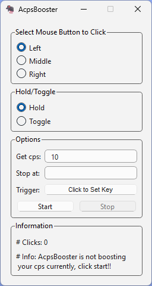

# AcpsBooster

A click speed booster for video games like Minecraft.

## Description

AcpsBooster is a lightweight, easy-to-use software designed to help you achieve faster click speeds in video games. It's perfect for games like Minecraft where quick reflexes and fast actions can give you an edge over your opponents.

## Features

- **Simple Interface:** User-friendly design that makes it easy to start boosting your click speed immediately.
- **Adjustable Speeds:** Customize the click rate to suit your gaming needs.

## Installation

To install AcpsBooster, follow these steps:

1. Download the latest release from the [GitHub repository](https://github.com/8gudbits/AcpsBooster/releases).
2. Unzip the downloaded file to your desired location.
3. Run the `AcpsBooster.exe` file to start the application.

## Usage

After launching AcpsBooster, adjust the click rate to your preferred speed. Press the 'Start' button to begin boosting your click speed. To stop, simply press the 'Stop' button.

## Screenshots

**Note**: The theme adapts to your Windows theme settings

 
 

## Contributing

Contributions are what make the open-source community such an amazing place to learn, inspire, and create. Any contributions you make are **greatly appreciated**.

1. Fork the Project
2. Create your Feature Branch (`git checkout -b feature/AmazingFeature`)
3. Commit your Changes (`git commit -m 'Add some AmazingFeature'`)
4. Push to the Branch (`git push origin feature/AmazingFeature`)
5. Open a Pull Request

